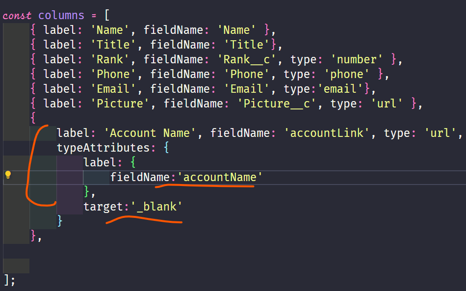
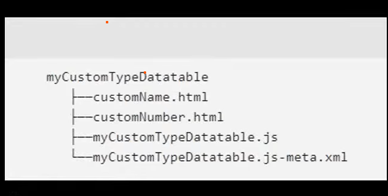

# Datatable in LWC 

## Custom Datatypes for Datatable 
- To modify the type we have to define *typeAttributes* and define the necessary attributes there . 
- 

### Apply styles on a column : 
There are 2 methods tp achive this : 
 1. Using *cellAttributes*
    >cellAttributes: {
        class:'slds-theme_shade slds-theme_alert-texture'
    }
 2. USing cell atributes  and use the *fieldNAme* attribute to wire up css classes. 
   > cellAttributes:{
    class : {fieldName:'industryClass'}
   }

   

   ##  Custom Types (Out of box functionailty )
   > Synatx is shown below for the custom types ✍️
   
    

    
    
## Inline Editing  in lightning datatable ✏️✏️

    

