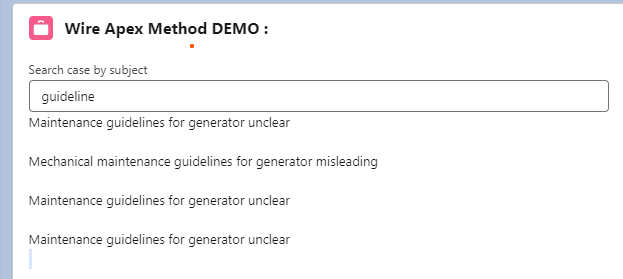

# Wire Apex Notes : 
### Note : The Data that we will get using the wire method will be read-only data 

### Pass Parameters in Wire Apex method Syntax 

> @track subject

>  @wire (methodName , { subject : '$subject'})
   cases 

   
   