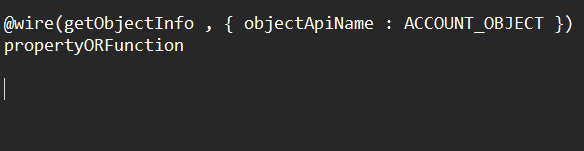
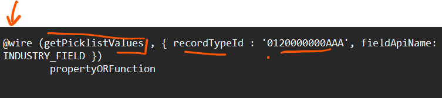
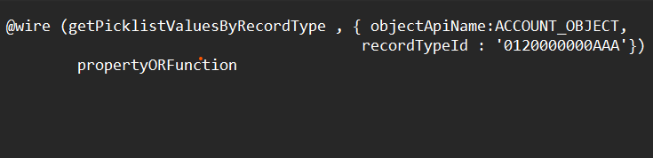

## Lightning UI Object Info API ✨

- getObject Information
- getPicklistvalues
- getPicklistvaluesByRecordTypes

### Syntax of getObjectInfo 

### Syntax for getting picklist information 🎯

### Synatax for getPicklistValuesByRecordType 🙇‍♂️

-> there are certain requirements where you have record types and based on recordtypes your picklist will vary. 

