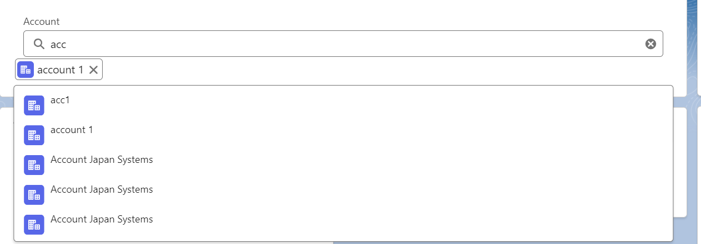

## First create a apex class with parameters taking in ObjectApiName and SearchKey 

## After That create a Query with help of Searceh key and wildcard % and limit that  query and return in form a generic SObject List 

## Create a lwc component having Array The logic described in comments in the attached LWC JS file 
## When the user enetrs some value in html we are Delaying the operation for some time period using setTimeout beacuse of server side performance optimization using a DELAY variable . 

## When the Search options are deisplayed We need to able to click and select the options as well due to which we must provide an onclick event listener on each of the li ie list items in the search result dropdown .. 

## When the item is clicked and selected we need to insert that item selected inside our array of selected records and show that array we created in form of pills . 

## To remove the pill from selected records we are using the remove handler where we are splicing the selected pills from the selectedRecords array items . 

